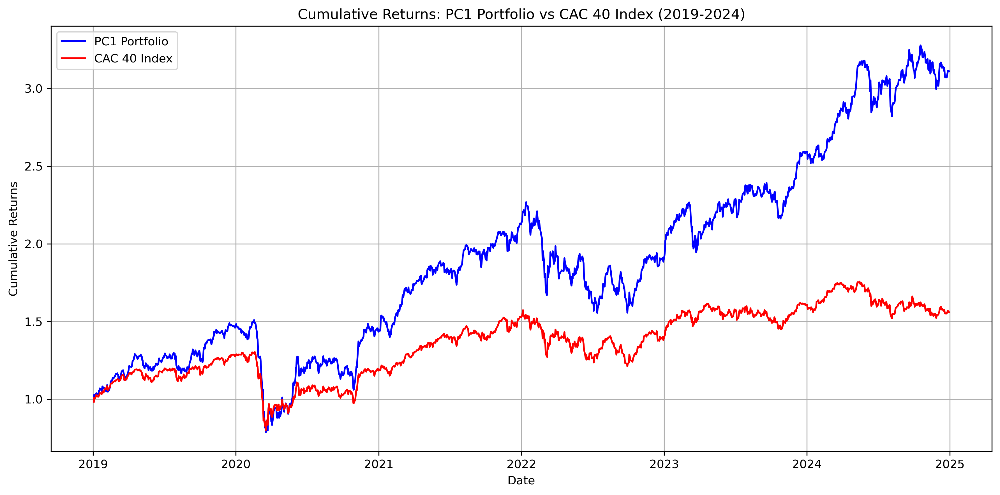

# Stock Market Analysis with PCA and Portfolio Optimization

## Overview
This project performs a comprehensive analysis of stock prices, log returns, and portfolio optimization using Principal Component Analysis (PCA). The workflow includes data retrieval, statistical analysis, visualization, and portfolio performance evaluation.

## Features
- **Stock Data Retrieval**: Load and preprocess stock price data.
- **Log Returns Calculation**: Compute log returns for time-series analysis.
- **PCA Analysis**: Reduce dimensionality and extract key market trends.
- **Portfolio Optimization**: Construct and compare different portfolios.
- **Data Visualization**: Generate histograms, time-series plots, and cumulative return comparisons.
- **CSV Export**: Save key results for further analysis.

## Dependencies
Ensure you have the following Python libraries installed:
```bash
pip install pandas numpy matplotlib seaborn scipy sklearn
```

## Usage
1. Clone this repository:
   ```bash
   git clone https://github.com/yourusername/your-repo.git
   ```
2. Navigate to the project directory:
   ```bash
   cd your-repo
   ```
3. Run the main script:
   ```bash
   python analysis.py
   ```
4. View generated CSV files and visualizations in the output directory.

## File Structure
```
📂 Project Folder
├── data/                 # Raw stock price data
├── output/               # Results and visualizations
├── analysis.py           # Main analysis script
├── requirements.txt      # List of dependencies
└── README.md             # Project documentation
```

## Results
- Principal Component Loadings and Explained Variance
- Portfolio Performance Compared to Market Index
- Visualization of Market Trends and Risk Factors

## Contributors
- **Basil Rehan** - Data Scientist & Actuarial Student

## License
This project is licensed under the MIT License - see the [LICENSE](LICENSE) file for details.

# Financial Data Analysis

This repository contains various analyses and visualizations related to financial data.

## Visualizations

### Cumulative Returns


### Log Returns


### Principal Component Analysis (PCA) Returns


### Portfolio vs Index Performance


### Residual Analysis


### Autocorrelation of Residuals


---
Make sure the images are inside an `images` folder in your repository for this to work. Let me know if you need modifications! 🚀
